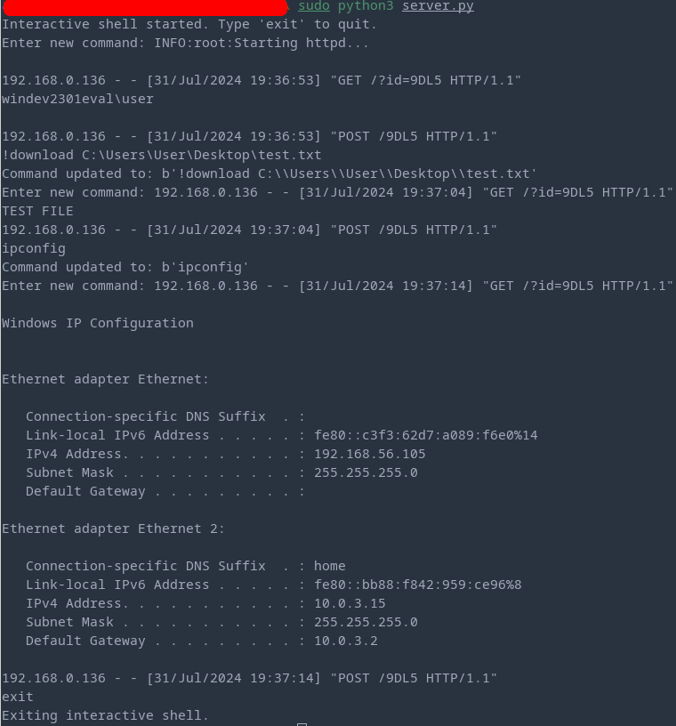

# Simple-C-Implant

Just a simple implant written in C. More information can be found on the corresponding blog post [https://www.ribbiting-sec.info/posts/2024-06-05_csharp_obfuscator/](https://www.ribbiting-sec.info/posts/2024-07-31_implant/)

## Usage

To use the implant you need to compile it with mingw and strip the binary

`x86_64-w64-mingw32-gcc -o implant.exe implant.c -lwininet -s`

Before compiling adjust the constants at the top of your file to include your C2 server, the domain in which you want to execute it and the sleep time.

The server can be started with: `python3 server.py`. Modify the port, as per default port 80 will be used.

You can issue commands which will be executed. Furthermore, I added one custom command `!download <PATH>` to read a file on the target system.

## Credits

Thanks for Stackoverflow for some code, I provided the sources for each inspiration I took.

Furthermore, thanks to the following blog post for the idea https://posts.specterops.io/deep-sea-phishing-pt-1-092a0637e2fd 
